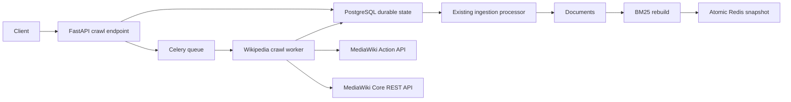

# Wikipedia Category Crawler Design

Date: 2026-07-21

## Goal

Add a production-style Wikipedia ingestion source to the search engine. A client
submits a bounded English Wikipedia category crawl, PostgreSQL durably records
the crawl frontier and every discovered article, Celery resumes interrupted
work, and successful pages enter the existing document-ingestion and BM25
publication pipeline.

The crawler should teach real crawler concerns without becoming an unbounded
internet crawler: structured discovery, breadth-first traversal, pagination,
rate limiting, concurrency, retry classification, content extraction,
idempotency, partial success, and observable background work.

## Scope

This milestone includes:

- `POST /api/v1/crawls/wikipedia` for bounded category crawls.
- English Wikipedia with `Category:Featured articles` as the default root.
- Optional breadth-first traversal through at most two subcategory levels.
- A hard limit of 1 to 500 discovered articles per run.
- Structured article and subcategory discovery through the MediaWiki Action
  API.
- Full rendered article retrieval through the MediaWiki Core REST HTML API.
- Bounded asynchronous fetching with a shared request-rate limit.
- Durable PostgreSQL state for the run, category frontier, continuation tokens,
  discovered pages, fetch outcomes, and ingestion links.
- Crash-safe Celery execution and idempotent redelivery.
- Reuse of the existing per-item document-ingestion processor.
- One BM25 rebuild and atomic Redis publication after changed documents finish.
- Generic job progress plus a paginated crawler-item result endpoint.
- Unit, PostgreSQL integration, worker, API, and live-service end-to-end tests.

This milestone does not include:

- Crawling arbitrary websites or accepting arbitrary source URLs.
- Following arbitrary links between Wikipedia articles.
- More than 500 articles or more than two subcategory levels per request.
- Languages other than English.
- Images, audio, video, tables, or media indexing.
- Scheduled or continuous recrawling.
- Updating an existing document when its Wikipedia revision changes.
- Wikimedia XML dump ingestion.
- Pause, cancellation, or a public manual-retry endpoint.
- Distributed fan-out where separate Celery tasks fetch individual pages.

Those are later extensions. In particular, revision-aware updates and dump
ingestion are valuable follow-up milestones after the bounded crawler is proven.

## Considered Approaches

### Browser-page HTML scraping

This is the approach used by the reference project. It downloads the Featured
Articles browser page, finds links through CSS classes, downloads article browser
pages, extracts paragraph tags with BeautifulSoup, writes an intermediate JSON
file, and later imports that file into SQLite.

It is approachable and demonstrates basic asynchronous scraping, but it couples
discovery to presentation markup, includes browser-page noise, lacks stable page
identifiers and continuation tokens, and makes crash recovery depend on local
files. The reference implementation also impersonates a browser user agent
instead of identifying the automated client as required by Wikimedia policy.
This approach is rejected.

### MediaWiki Action API only

The Action API can provide structured category members and either raw wikitext
or TextExtracts output. This avoids browser-page discovery and provides stable
page ids and pagination.

Raw wikitext requires template-aware parsing and can leave substantial search
noise. TextExtracts is convenient for summaries, but its documentation advises
against building new Wikimedia production features on that API, and it is not a
strong full-article contract. This approach is not selected for article content.

### Action API discovery plus Core REST HTML

The Action API supplies category members, namespaces, stable page ids, and
opaque continuation state. The MediaWiki Core REST page endpoint supplies the
full rendered article as Parsoid HTML. A dedicated extractor converts that
structured HTML into searchable prose.

This design has two external interfaces and requires explicit extraction tests,
but it gives deterministic discovery, complete article content, stable source
identity within a run, and less coupling to Wikipedia's browser layout. It is
the selected approach.

### Wikimedia dumps

Dumps are the right source for offline ingestion of very large corpora. They
require large downloads, compressed XML streaming, wikitext parsing, checkpointed
file processing, and a different operational model. They are not an interactive
crawler and remain a separate future ingestion source.

## Chosen Architecture

PostgreSQL is the source of truth for the job lifecycle, crawl request, frontier,
discovered pages, fetch outcomes, ingestion outcomes, and documents. Redis is
the Celery broker/result backend and versioned search-snapshot store.



The API creates a `wikipedia_crawl` job, crawl-run row, and root frontier row in
one transaction. Celery receives only the same UUID used by the public job:

```text
PostgreSQL job id = public API job id = Celery task id
```

The worker discovers a deterministic bounded frontier, fetches pending articles,
stages normalized document payloads, processes pending ingestion items, rebuilds
the complete active corpus once when needed, and records a durable final result.

## API Contract

### Submit A Crawl

`POST /api/v1/crawls/wikipedia` accepts:

```json
{
  "category": "Featured articles",
  "max_articles": 100,
  "max_depth": 0
}
```

All fields are optional and unknown fields are rejected. Defaults and bounds
are:

| Field | Default | Rules |
| --- | --- | --- |
| `category` | `Featured articles` | Non-blank string, at most 255 characters |
| `max_articles` | `100` | Integer from 1 through 500 |
| `max_depth` | `0` | Integer from 0 through 2 |

The category may be supplied as `Featured articles` or
`Category:Featured articles`. Surrounding whitespace is removed and the stored
form always has one `Category:` prefix. URLs, control characters, and an empty
category are rejected with HTTP `422`. The server, scheme, and API paths are
fixed in configuration rather than derived from user input, preventing SSRF.

A successful submission returns HTTP `202 Accepted` using the existing accepted
job shape:

```json
{
  "job_id": "<uuid>",
  "status": "PENDING",
  "status_url": "/api/v1/jobs/<uuid>"
}
```

If any background job owns the `search_index` resource, the endpoint returns
HTTP `409 Conflict` with the active job id and status URL. PostgreSQL or broker
submission failures return HTTP `503` with a stable public error.

### Inspect Page Outcomes

`GET /api/v1/crawls/wikipedia/{job_id}/items` accepts the existing pagination
convention:

```text
limit:  1..100, default 100
offset: >= 0, default 0
```

It returns items in deterministic discovery position with:

- Wikipedia page id, title, and canonical URL.
- Fetch status and ingestion status.
- Created document id when imported.
- A concise safe error when fetching, extraction, or ingestion failed.

A UUID that does not identify a Wikipedia crawl returns HTTP `404`. PostgreSQL
failure returns HTTP `503`. Full article content and raw HTML are never returned
by this endpoint.

Generic lifecycle, progress, and final result remain available through
`GET /api/v1/jobs/{job_id}`.

## Shared Search-Index Resource

The crawl job uses:

```text
job_type = 'wikipedia_crawl'
resource_key = 'search_index'
```

The existing partial unique index on active job resources therefore prevents a
crawl from overlapping bulk ingestion, another crawl, or a manual rebuild that
could publish an older snapshot last. A crawl request always represents new
work, so it does not reuse an active crawl job.

This milestone preserves the existing contract for ordinary synchronous
document CRUD: those operations retain their current process-local update and
eventual-consistency behavior. General coordination between synchronous writes
and background snapshot publication is a separate cross-cutting improvement.

## Data Model

### Wikipedia Crawl Runs

`wikipedia_crawl_runs` contains one row per crawler job:

| Column | Type | Rules |
| --- | --- | --- |
| `job_id` | PostgreSQL UUID | Primary key and FK to `jobs.id`, cascade on delete |
| `root_category` | text | Required canonical `Category:` title |
| `max_articles` | integer | Required, 1 through 500 |
| `max_depth` | smallint | Required, 0 through 2 |
| `discovery_complete` | boolean | Required, initially false |
| `category_limit_reached` | boolean | Required, initially false |
| `created_at` | timestamptz | Required, database-generated |
| `updated_at` | timestamptz | Required, changed with checkpoints |

The job row owns lifecycle status. The crawl-run row owns immutable request
parameters and the discovery checkpoint. `category_limit_reached` becomes true
only when another eligible subcategory is suppressed by the internal safety
limit, so an exact 100-category crawl that naturally ends is not misreported.

### Wikipedia Crawl Frontier

`wikipedia_crawl_frontier` stores the durable breadth-first category queue:

| Column | Type | Rules |
| --- | --- | --- |
| `id` | bigint identity | Primary key |
| `job_id` | PostgreSQL UUID | Required FK to crawl run, cascade on delete |
| `category_title` | text | Required canonical category title |
| `depth` | smallint | Required, 0 through the run's maximum depth |
| `continuation` | JSON | Nullable opaque Action API continuation object |
| `status` | text | `pending`, `completed`, or `failed` |
| `error` | text | Nullable safe terminal reason |
| `created_at` | timestamptz | Required, database-generated |
| `updated_at` | timestamptz | Required, changed with every checkpoint |

`(job_id, category_title)` is unique. Pending and completed rows have no error;
failed rows require one. A pending row with null continuation has not requested
its first page. A pending row with continuation resumes from that opaque token.
A completed row has consumed its final page.

The root category has depth zero. When `max_depth` is zero, its articles are
discovered but its subcategories are not queued. With depth one, immediate
subcategories are also queried, and so on. Pending frontier rows are selected by
ascending depth and insertion id, producing breadth-first deterministic order.

An internal configuration limit of 100 visited categories prevents sparse or
pathological category trees from doing unbounded work even when fewer than the
requested articles are found. Reaching this guard is reported in the final
result rather than silently expanding the crawl.

### Wikipedia Crawl Pages

`wikipedia_crawl_pages` contains one row for each accepted article:

| Column | Type | Rules |
| --- | --- | --- |
| `id` | bigint identity | Primary key |
| `job_id` | PostgreSQL UUID | Required FK to crawl run, cascade on delete |
| `position` | integer | Required zero-based discovery position |
| `wikipedia_page_id` | bigint | Required source page id |
| `title` | text | Required normalized article title |
| `canonical_url` | text | Required English Wikipedia article URL |
| `fetch_status` | text | `pending`, `fetched`, or `failed` |
| `fetch_attempts` | integer | Required non-negative count |
| `ingestion_item_id` | bigint | Nullable unique FK to `ingestion_items.id` |
| `error` | text | Nullable safe fetch or extraction reason |
| `fetched_at` | timestamptz | Nullable successful-fetch timestamp |
| `created_at` | timestamptz | Required, database-generated |
| `updated_at` | timestamptz | Required, changed with the outcome |

`(job_id, position)` and `(job_id, wikipedia_page_id)` are unique. Coherence
constraints require:

- `pending` has no ingestion item, error, or fetch timestamp.
- `fetched` has an ingestion item and fetch timestamp but no error.
- `failed` has an error and no ingestion item or fetch timestamp.

The crawler table owns only discovery and fetch state. The linked existing
`ingestion_items` row remains the single source of truth for `pending`,
`imported`, `skipped`, or `failed` document-ingestion state. This avoids two
copies of the import outcome drifting apart.

The crawler records source page ids for audit and in-run deduplication. Cross-run
deduplication continues to use the existing unique document URL. Revision-aware
updates and stable cross-run source identity are intentionally deferred.

## Components

### Crawl API Service

The API-facing service:

1. Normalizes and validates the category request.
2. Checks for an active `search_index` resource owner.
3. Generates one UUID.
4. Creates the pending job with unknown progress total and `Waiting for worker`.
5. Creates the crawl run and depth-zero root frontier row.
6. Commits all three records atomically.
7. Sends the Celery task with the UUID as argument and task id.
8. Returns the durable job.

The database's active-resource unique index remains the final race guard between
concurrent API processes. If enqueueing normally fails after commit, the service
marks the job failed and returns HTTP `503`. A process crash between commit and
broker send can still leave a stale pending job, matching the existing job
design; a transactional outbox remains outside this milestone.

### Wikipedia Client

One injected client boundary owns both Wikimedia interfaces:

```text
discover_category(category, continuation) -> category batch
fetch_article(title) -> fetched HTML response
```

The client uses `httpx.AsyncClient` with connection reuse. All Wikimedia
requests, including discovery, share:

- A fixed HTTPS host and fixed API paths.
- At most four concurrent requests.
- A global limit of two request starts per second.
- A 30-second total request timeout.
- A 10 MiB response-body limit enforced while streaming.
- JSON and content-type validation before parsing.
- A descriptive configurable bot user agent.

The default user agent identifies the project and repository:

```text
SatyamSearchEngineBot/1.0 (https://github.com/satyamarora26/search-engine)
```

Configuration may replace that value, but it may not be blank or a generic
library user agent. The client follows Wikimedia throttling instructions and
never sends authentication cookies.

The Action API request uses `list=categorymembers`, namespace zero for articles,
namespace fourteen for subcategories, ascending sort-key order, and the response's
opaque continuation object. Redirect and normalized Core REST responses are
followed only while they remain on the configured Wikipedia host.

### Article Extractor

A pure extractor receives Core REST HTML and returns normalized searchable text.
It has no HTTP, database, Celery, or indexing responsibilities.

BeautifulSoup with the `lxml` parser processes the Parsoid document. Extraction:

- Keeps article `h2`, `h3`, paragraph, and meaningful list-item text.
- Removes scripts, styles, navigation, figures, tables, citation markers, and
  reference lists.
- Excludes sections headed References, Notes, Citations, Bibliography, External
  links, Further reading, and See also.
- Normalizes repeated horizontal whitespace.
- Preserves paragraph and heading boundaries with newlines.
- Preserves Unicode content.
- Rejects malformed responses, missing article bodies, empty output, and output
  shorter than 100 visible characters.

Raw HTML is not stored. The successful normalized payload contains only the
article title, extracted content, and canonical source URL. Keeping the source
URL supports duplicate detection and Wikimedia attribution.

### Discovery Runner

The runner claims the pending job and resumes a started job. It processes pending
frontier rows in breadth-first order.

For every Action API response, one short transaction:

1. Inserts newly encountered namespace-zero pages until `max_articles` is met.
2. Assigns deterministic positions in response order.
3. Inserts unseen subcategories only when their depth is allowed.
4. Saves the returned continuation object or completes the category.
5. Marks discovery complete when the article limit, frontier end, or category
   safety limit is reached.

If the worker dies before that transaction commits, no checkpoint or discovered
member from the response is retained. If it dies after commit, a retry starts at
the saved continuation. Unique constraints also make replayed members harmless.

No database session or transaction remains open during a Wikimedia request.

### Fetch And Staging Runner

After discovery, the runner fixes job progress total at:

```text
discovered article count + 1 final index step
```

It reads pending page metadata in bounded batches, closes the database session,
and fetches the batch asynchronously. Results are persisted independently so one
bad page cannot roll back another.

For a successful extraction, one transaction:

1. Creates an `ingestion_items` row with the crawl job id and page position.
2. Stores the normalized title, content, and canonical URL payload.
3. Marks the crawl page `fetched` and links the ingestion item.

For a terminal fetch or extraction problem, one transaction marks the page
`failed` with a safe reason. A retry cannot overwrite a terminal page outcome.

The worker then passes pending linked items to the existing
`IngestionItemProcessor`. That component retains responsibility for strict
document validation, duplicate-URL classification, independent transactions,
and idempotent terminal outcomes. Crawl-specific orchestration does not duplicate
document insertion logic.

### Crawl Celery Task

The bound task is named `wikipedia.crawl`, receives only a string job UUID, and
verifies its Celery request id equals that UUID. It uses:

- Late acknowledgement.
- Worker-loss rejection.
- A PostgreSQL advisory lock scoped to the job UUID.
- The durable job and crawler state as the source of truth.

Only a `wikipedia_crawl` job may run through this task. A concurrent duplicate
delivery exits without failing the real execution. A successful terminal
redelivery returns the stored result; a failed terminal redelivery does no work.

After every page has a terminal fetch and ingestion outcome:

- Rebuild and publish `redis-<job-id>` once when at least one document imported.
- Otherwise reuse the current active index version and skip rebuilding.
- Mark the job successful with durable summary counts when the success conditions
  below are met.

## Progress And Result

Discovery starts with an unknown total:

```text
PENDING  0/?       Waiting for worker
STARTED  0/?       Discovering Wikipedia articles
```

After discovering `N` pages, total progress becomes `N + 1`. One page step is
complete when it is fetch-failed or its linked ingestion item is terminal:

```text
STARTED  0/(N+1)   Fetching Wikipedia articles
STARTED  X/(N+1)   Processed article X of N
STARTED  N/(N+1)   Rebuilding search index
SUCCESS  (N+1)/(N+1)  Wikipedia crawl completed
```

When no document imported, the final step reports `No index changes required`
before completion.

The success result stored in `jobs.result` is:

```json
{
  "root_category": "Category:Featured articles",
  "max_articles": 100,
  "max_depth": 0,
  "categories_visited": 1,
  "category_limit_reached": false,
  "discovered_count": 100,
  "fetched_count": 98,
  "imported_count": 90,
  "duplicate_skipped_count": 7,
  "fetch_failed_count": 2,
  "ingestion_failed_count": 1,
  "failed_count": 3,
  "index_rebuilt": true,
  "index_version": "redis-<job-id>"
}
```

The following count invariants must hold:

```text
fetched_count + fetch_failed_count = discovered_count
imported_count + duplicate_skipped_count + ingestion_failed_count = fetched_count
fetch_failed_count + ingestion_failed_count = failed_count
```

## Retry And Failure Handling

### Wikimedia Requests

Timeouts, connection failures, HTTP `408`, HTTP `429`, and HTTP `5xx` are
retryable. A single request receives at most three attempts with exponential
backoff, full jitter, and `Retry-After` support. The client never retries faster
than a valid server-provided delay.

Missing pages and other permanent HTTP `4xx` responses are page-level terminal
failures. Invalid content types, oversized responses, malformed HTML, and
insufficient extracted text are also terminal for that page.

An exhausted root or frontier discovery request raises a transient task error
because discovery cannot safely continue without its next page. An exhausted
article-content request becomes an item-level fetch failure so other discovered
pages can complete.

### Celery Retries

Transient PostgreSQL operational failures, Redis connection failures, and
exhausted transient discovery requests retry the Celery task up to three times
with increasing delays. Durable continuation, fetch, and ingestion state allows
the next attempt to resume rather than restart.

If task retries are exhausted, the job becomes `FAILURE`. If PostgreSQL is also
unavailable while recording final failure, the job can remain `STARTED`; Celery
and worker logs retain the failure, matching the existing job-tracking limitation.

Unexpected programming or invariant errors are logged, recorded with a stable
public error, and re-raised. Raw response bodies, database messages, secrets, and
stack traces never enter public job or item errors.

### Completion Semantics

The complete job fails when:

- The root category cannot be discovered after task retries.
- Discovery reaches a terminal state without any articles.
- Every discovered page fails fetching or extraction.
- No fetched page reaches either `imported` or duplicate `skipped` ingestion
  status.
- Required PostgreSQL or Redis work exhausts task retries.
- A programming or state invariant fails.

The complete job succeeds with visible partial-failure counts when at least one
page imports or is safely classified as an existing duplicate. A run containing
only duplicate documents succeeds and does not rebuild the index. A run with at
least one imported document rebuilds once even if other pages failed.

If documents were imported but Redis publication ultimately fails, PostgreSQL
remains authoritative and the previous Redis snapshot remains active. The job
is failed rather than claiming the new documents are searchable. A later manual
rebuild can publish the complete PostgreSQL corpus.

## Idempotency And Recovery

The design has several independent idempotency layers:

- One active `search_index` resource owner is enforced in PostgreSQL.
- The Celery task id and public job id are identical.
- A job-scoped PostgreSQL advisory lock prevents concurrent duplicate execution.
- Frontier categories are unique within a job.
- Discovered Wikipedia page ids are unique within a job.
- Every page has one deterministic position and at most one ingestion item.
- Terminal fetch records reject replacement.
- Terminal ingestion records reject replacement.
- Non-null document URLs remain globally unique.
- Versioned Redis publication switches the active pointer atomically.

A worker crash during HTTP I/O leaves the page or frontier pending. A crash after
a database transaction keeps the committed checkpoint. A crash after document
insertion but before the final rebuild leaves terminal ingestion outcomes, so a
redelivery skips inserts and proceeds to publication.

## Observability

Structured logs include the job id, phase, category, page id, discovery position,
HTTP attempt, and stable outcome. Logs never include full HTML or article content.

Job progress uses the visible phases:

- `Discovering Wikipedia articles`
- `Fetching Wikipedia articles`
- `Ingesting Wikipedia articles`
- `Rebuilding search index`
- `Wikipedia crawl completed`

The final result and item endpoint expose partial failures rather than reducing
the run to one success boolean. Durable rows remain stored indefinitely under
the current v1 retention policy for learning and diagnosis.

## Testing Strategy

### Unit Tests

- Category normalization, defaults, strict fields, bounds, and URL rejection.
- Breadth-first category order, maximum depth, category safety limit, article
  limit, continuation handling, and duplicate page/category suppression.
- Canonical article URL construction and host validation.
- Shared rate limiting, concurrency bounds, timeouts, response-size limits, and
  content-type validation.
- Retry behavior for connection failures, `408`, `429`, `Retry-After`, `5xx`, and
  permanent `4xx` responses.
- Extractor fixtures covering prose, headings, lists, references, excluded
  sections, tables, malformed HTML, Unicode, whitespace, and short content.
- Runner resume behavior from every durable phase.
- Result counts, progress transitions, completion rules, and no-change rebuild
  behavior.
- Celery task-id validation, job-type validation, retry exhaustion, advisory-lock
  contention, duplicate delivery, and safe failure recording.

HTTP unit tests use `httpx.MockTransport` or an injected fake client. Normal test
runs never depend on Wikimedia availability or network timing.

### PostgreSQL Integration Tests

- Transactional job/run/root-frontier creation.
- Check constraints and all uniqueness guarantees.
- Atomic discovery-member plus continuation checkpoints.
- Concurrent duplicate category and page insertion.
- Atomic ingestion-item staging plus fetched-page transition.
- Crash-style retries that leave pending work resumable.
- Duplicate document URLs becoming skipped outcomes.
- Active `search_index` resource conflicts across rebuild, bulk, and crawl jobs.

### API And Worker Integration Tests

- HTTP `202`, `409`, `422`, `404`, and `503` contracts.
- Generic job progress and crawler item pagination.
- Enqueue failure and resource-creation race behavior.
- Celery retry and redelivery using the real PostgreSQL state transitions.
- Search-index publication failure preserving the previous active version.

### End-To-End Verification

A deterministic end-to-end test runs separate FastAPI and Celery processes with
real PostgreSQL and Redis plus a local fake Wikimedia HTTP server. The fake server
serves paginated category JSON, redirects, successful article HTML, a duplicate,
a permanent failure, and a transient retry response.

The test submits a crawl through HTTP, waits through the jobs API, inspects item
outcomes, and searches for a distinctive crawled term. It verifies exact counts,
one BM25 publication, and a ranked search result. A second delivery verifies no
duplicate inserts or publication.

An optional manual smoke test may crawl at most three real Wikipedia articles
using the configured descriptive user agent. It is never part of deterministic
automated test execution.

## Dependencies And Configuration

Runtime dependencies added or corrected by this milestone are:

- `httpx` for the asynchronous Wikimedia client.
- `beautifulsoup4` for DOM selection.
- `lxml` for robust HTML parsing.

Crawler settings include fixed Action and Core REST base URLs, user agent,
concurrency, requests per second, timeout, response-size limit, maximum visited
categories, and fetch-attempt count. Production defaults implement the bounds in
this design; tests inject lower limits and local URLs without changing global
process state.

The Celery app explicitly imports the crawler task module.

## Documentation

The implementation adds a focused crawler guide covering:

- Starting PostgreSQL, Redis, FastAPI, and Celery.
- Configuring a compliant user agent.
- Submitting and monitoring a crawl.
- Interpreting item outcomes and final counts.
- Running deterministic tests and the optional live smoke test.
- Wikimedia attribution and the retained canonical source URLs.

## Acceptance Criteria

The milestone is complete when:

- A valid request returns one durable crawl job without contacting Wikipedia in
  the API process.
- The worker discovers bounded category members through opaque continuation.
- Subcategory traversal is deterministic, depth-limited, and category-limited.
- Fetching obeys concurrency, rate, timeout, size, retry, and user-agent rules.
- Every discovered page has one durable inspectable terminal outcome.
- A worker restart resumes without repeating terminal work or duplicating
  documents.
- Duplicate URLs are skipped without failing valid pages.
- Partial page failures remain visible while usable runs can succeed.
- A changed corpus publishes one new atomic BM25 snapshot.
- An unchanged duplicate-only corpus does not rebuild.
- The end-to-end test proves newly crawled content is searchable.
- The default and expanded PostgreSQL/Redis suites pass.

## Primary References

- MediaWiki Categorymembers API:
  https://www.mediawiki.org/wiki/API:Categorymembers
- MediaWiki Core REST page endpoint migration:
  https://www.mediawiki.org/wiki/RESTBase/service_migration
- Wikimedia API Usage Guidelines:
  https://foundation.wikimedia.org/wiki/Policy:Wikimedia_Foundation_API_Usage_Guidelines
- Wikimedia User-Agent Policy:
  https://foundation.wikimedia.org/wiki/Policy:Wikimedia_Foundation_User-Agent_Policy
- Wikimedia content and data access overview:
  https://developer.wikimedia.org/use-content/content/
- Wikimedia data dump formats for the deferred bulk-ingestion path:
  https://meta.wikimedia.org/wiki/Data_dumps/What's_available_for_download
